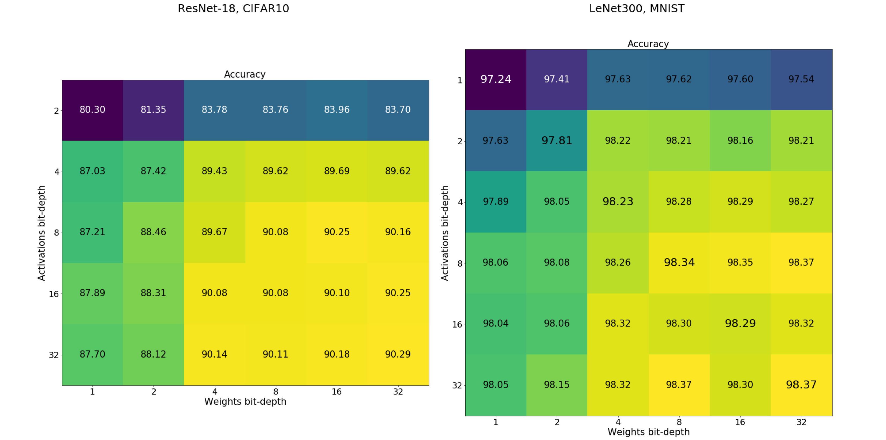

# Quantization Schemes For Training Neural Networks

This work shows how to train neural networks with quantized weights directly via backpropagation. The code
quantizes weights as well as activations. It runs LeNet-300 on MNIST and ResNet18 on CIFAR10 datasets.
More details in [this pdf]( https://github.com/stracini-git/qnn/blob/main/files/Quantization_Schemes.pdf)


## Run Experiment

**--wbits** specifies the number of bits for weights\
**--abits** specifies the number of bits for activations

```markdown
python Trainer.py --wbits 4 --abits 4
```


## Results

